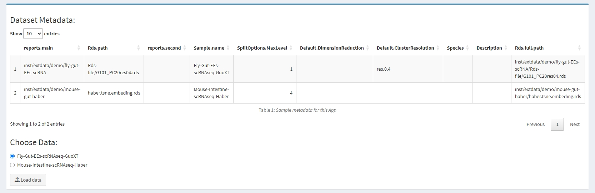
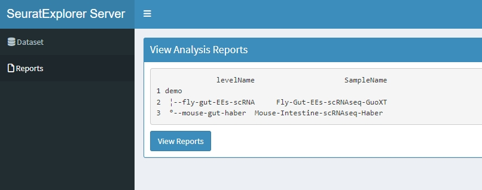
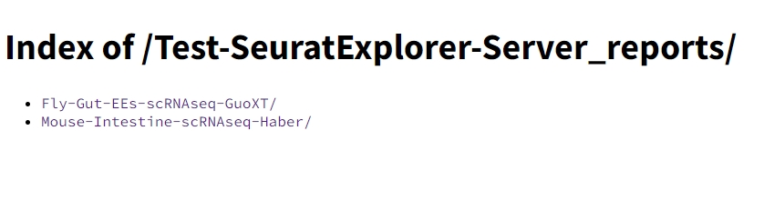
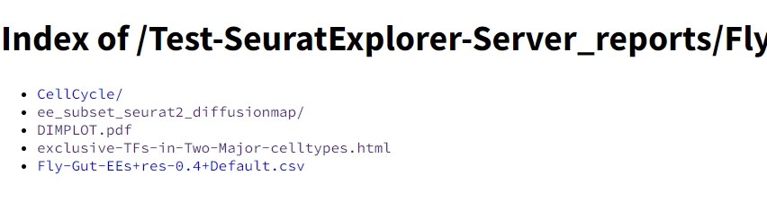
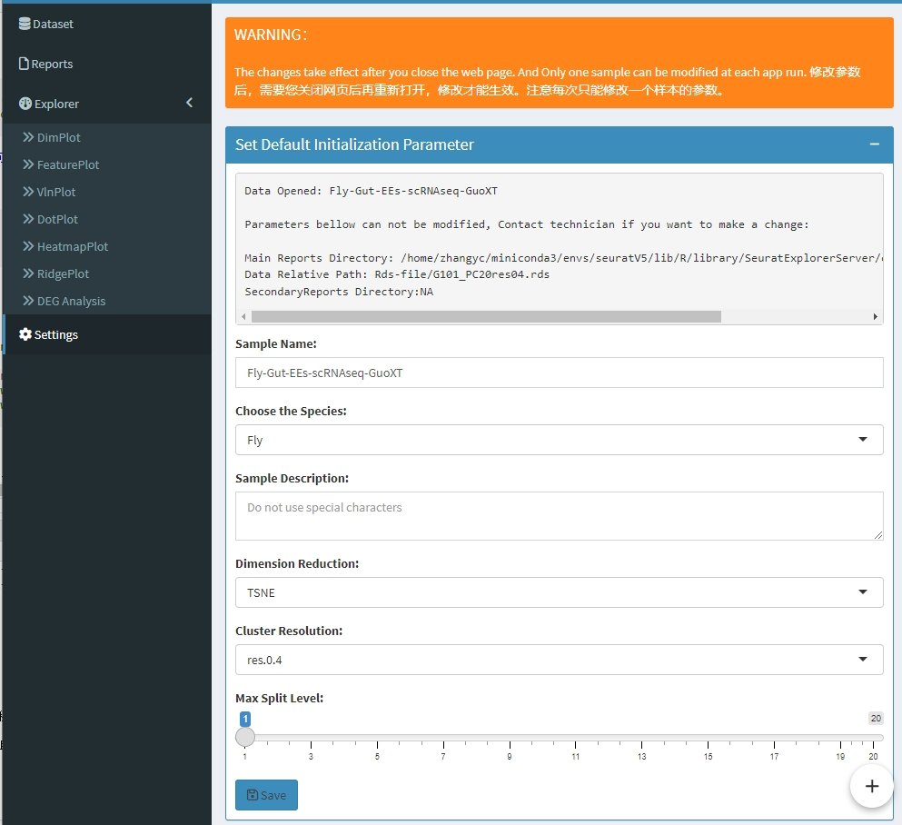

<!-- README.md is generated from README.Rmd. Please edit that file -->

```{r, include = FALSE}
knitr::opts_chunk$set(
  collapse = TRUE,
  comment = "#>",
  fig.path = "man/figures/README-",
  out.width = "100%"
)
```

```{r echo=FALSE, results="hide", message=FALSE}
library(badger)
```

# SeuratExplorerServer

<!-- badges: start -->
`r badge_lifecycle("stable")`
`r badge_devel("fentouxungui/SeuratExplorerServer", "rossellhayes")`
`r badge_code_size("fentouxungui/SeuratExplorerServer")`
<!-- badges: end -->

> 可用于搭建单细胞数据库，允许用户访问位于服务器上的分析结果。该R包支持 ``App`` 加密、多数据切换、分析报告浏览及下载、分析结果检索及再分析（基于``SeuratExplorer``）和自定义初始化参数。


## 1. 功能介绍

***数据加密***

对于未公开数据，可对 ``App`` 设置密码，限制访问。

***多数据切换***

做完某个分析后，可能会提取某种细胞类型，进行再分析，将得到新的 ``Seurat`` 对象，这样多个 ``Seurat`` 对象可以放到同一个 ``App`` 中；或者某篇文章里做了多个单细胞数据分析，所有的分析结果也都可以放到同一个 ``App`` 中。

***分析报告浏览***

支持浏览、查看和下载分析过程中产生的分析报告文件，包括``pdf, html, tiff, csv, jpg, jpeg, png, bmp, svg`` 等格式，也可通过修改参数指定其它类型文件。

***支持自定义数据的初始化参数***

可以设置数据加载后的默认参数，比如``Cluster Resolution、Species、Dimension Reduction`` 等。

***可拓展性***

多个由``SeuratExplorerServer`` 搭建的 ``App``，可组成一个小型单细胞数据库，分别通过对应目录进行访问。将每个 ``App`` 的访问地址及数据信息汇总到一个 ``index`` 网页中，这样用户可以查找相关数据，并访问。这部分暂不提供相关 ``DEMO`` 代码。

***与``SeuratExplorer``的关系与区别***

``SeuratExplorer``相当于一个桌面版软件，允许在本地电脑上查看和分析单个``Seurat``分析结果，即使把``SeuratExplorer``安装到服务器上，那也只能通过上传数据方式来浏览客户端电脑上的单细胞数据。而``SeuratExplorerServer``可作为``Shiny app``部署到服务器上，用户可通过网页来访问位于服务器上的单细胞数据，该R包不仅具有``SeuratExplorer``  包的所有功能外，还可以查看中间分析结果，并且支持多数据切换、密码保护和自定义部分初始化参数等功能。``SeuratExplorerServer``依赖于``SeuratExplorer``，并且具备所有``SeuratExplorer``里的数据分析功能。

## 2. 安装及运行

You can install the development version of ``SeuratExplorer`` and ``SeuratExplorerServer``like so:

```{r eval=FALSE}
# install dependency
if(!require(devtools)){install.packages("devtools")}
install_github("fentouxungui/SeuratExplorer")

# install SeuratExplorerServer
options(timeout = max(300, getOption("timeout")))
install_github("fentouxungui/SeuratExplorerServer")
```

Run a demo app on local:

```{r eval=FALSE}
library(SeuratExplorerServer)
launchSeuratExplorerServer()
```

Demo deployed by ``shinyserver`` [**Open**](http://www.nibs.ac.cn:666/Test-SeuratExplorer-Server/):

```{r eval=FALSE}
# app.R
library(SeuratExplorerServer)
launchSeuratExplorerServer()
```

## 4. 软件工作流

- 登录：输入账户和密码。

- 数据选择、加载和切换。

- ``sample meta``信息展示及下载。

- 浏览分析报告：单击``Generate/Update Reports`` 按钮，会在 ``App`` 所在目录（如：``Fly-Gut-EEs-scRNAseq``）的上层目录创建同名但以 ``_reports`` 为后缀的目录（如： ``Fly-Gut-EEs-scRNAseq_reports``），``sample meta`` 中 ``Reports.main`` 列和 ``Reports.second``列的对应目录中里的符合类型的文件，会以快捷连接方式放到 ``_reports`` 目录中。

- ``SeuratExplorer``里的功能。

- 修改样本元信息的默认参数，重启后生效。

- 关闭时会删除``_reports``目录（如：``Fly-Gut-EEs-scRNAseq_reports``）


## 5. Tutorials

### 5.1 Generate credentials

Please refer to R package [shinymanager](https://github.com/datastorm-open/shinymanager) for details to generate a credentials data.

```{r eval=FALSE}
# Init DB using credentials data
credentials <- data.frame(
  user = "shiny",
  password = "12345",
  stringsAsFactors = FALSE
)
```

### 5.2 Generate sample metadata parameters

从 ``dataframe`` 生成 ``metadata``。

```{r eval=TRUE}
data_meta <- data.frame(
  # 必填：主分析目录, Rds文件位于此目录中，并且所有位于该目录下的指定文件也会被收录到reports中，以sample name进行命名和区分。
  Reports.main = c(system.file("extdata/demo", "fly", package ="SeuratExplorerServer"), system.file("extdata/demo", "mouse", package ="SeuratExplorerServer")), 
  # 必填：Rds文件在主分析目录中的相对目录
  Rds.path = c("Rds-file/G101_PC20res04.rds", "haber.tsne.embeding.rds"),
  # 必填：次要分析目录，此目录中的分析报告也会被加载到reports临时目录中，比如cellranger的结果，会被放到Others子目录下。
  Reports.second = c(NA, NA), 
  # 必填：Sample name
  Sample.name = c("Fly-Gut-EEs-scRNAseq-GuoXT", "Mouse-Intestine-scRNAseq-Haber"), 
  # 选填： 用于设定split选项的参数,如果是多样本数据合并，一般该值要大于或等于样本数。
  SplitOptions.MaxLevel = c(1, 4), 
  # 选填： dimension reduction的默认值。
  Default.DimensionReduction = c("tsne", "umap"),
  # 选填： cluster的默认值。
  Default.ClusterResolution = c("res.0.4", NA),
  # 选填： Human, Mouse, Fly or Others
  Species = c("Fly", "Mouse"), 
  # 选填：description of the sample or the analysis, or whatever.
  Description = c("blabla","hahaha"), 
  stringsAsFactors = FALSE)

data_meta

# check the meta data
library(SeuratExplorerServer)
invisible(check_metadata(parameters = data_meta))
# if check passed, save the meta data
# saveRDS(data_meta, file = "data_meta.rds")
```

或直接使用 ``initialize_metadata`` 函数生成 ``meta data``:

```{r}
library(SeuratExplorerServer)
data_meta <- initialize_metadata(
  Reports.main = c(system.file("extdata/demo", "fly", package ="SeuratExplorerServer"), system.file("extdata/demo", "mouse", package ="SeuratExplorerServer")),
  Rds.path = c("Rds-file/G101_PC20res04.rds", "haber.tsne.embeding.rds"),
  Reports.second = c(NA, NA), Sample.name = c("Fly-Gut-EEs-scRNAseq-GuoXT", "Mouse-Intestine-scRNAseq-Haber"))

data_meta

# save metadata
# saveRDS(data_meta, file = "data_meta.rds")
```

必填项目一般是由数据分析员设定的，其他参数可以在 ``App`` 运行过程中进行修改, 即允许用户自行设定。

### 5.3 Run app

```{r eval=FALSE}
library(SeuratExplorerServer)
launchSeuratExplorerServer(Encrypted = TRUE, 
                           credentials = credentials,
                           paramterfile = "sample-paramters.rds",
                           TechnicianEmail = "your-email",
                           TechnicianName = "your-name")
```

## 6. Screenshots


```{r echo = FALSE, out.width="50%"}

```

```{r echo = FALSE, out.width="80%"}





```

## 7. Rsession info

```{r echo=FALSE}
sessionInfo()
```


