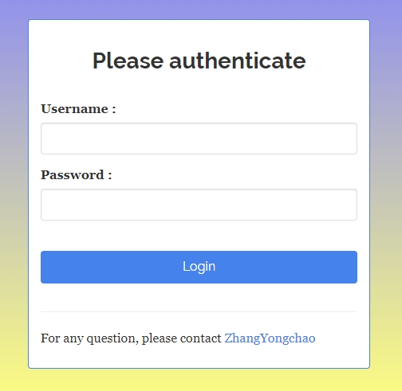

<!-- README.md is generated from README.Rmd. Please edit that file -->

```{r, include = FALSE}
knitr::opts_chunk$set(
  collapse = TRUE,
  comment = "#>",
  fig.path = "man/figures/README-",
  out.width = "100%"
)
```

```{r echo=FALSE, results="hide", message=FALSE}
library(badger)
```

# SeuratExplorerServer

<!-- badges: start -->
`r badge_lifecycle("stable")`
`r badge_devel("fentouxungui/SeuratExplorerServer", "rossellhayes")`
`r badge_code_size("fentouxungui/SeuratExplorerServer")`
<!-- badges: end -->

搭建您的单细胞数据库网站。

> 允许用户访问位于服务器上的分析结果。支持 ``App`` 加密、多数据切换、分析报告浏览及下载、分析结果检索及再分析（基于``SeuratExplorer``）和自定义初始化参数等功能。

> 生信工程师可通过``SeuratExplorerServer`` 搭建多个 ``App``，从而组建成一个单细胞数据库，每个 ``App`` 分别通过各自目录进行访问，将所有 ``App`` 的访问地址及数据信息汇总到一个 ``index`` 网页中，这样用户可通过该网页查找和访问相关数据。


## 1. 功能介绍

***数据加密***

对于未公开数据，可对 ``App`` 设置密码，限制访问。

***多数据切换***

做完某个分析后，可能会提取某种细胞类型，进行再分析，将得到新的 ``Seurat`` 对象，这样多个 ``Seurat`` 对象可以放到同一个 ``App`` 中；或者某篇文章里做了多个单细胞数据分析，所有的分析结果也都可以放到同一个 ``App`` 中。

***分析报告浏览***

支持浏览、查看和下载分析过程中产生的分析报告文件，包括``pdf, html, tiff, csv, jpg, jpeg, png, bmp, svg`` 等格式，也可通过修改参数指定其它类型文件。

***支持自定义数据的初始化参数***

可以设置数据加载后的默认参数，比如``Cluster Resolution、Species、Dimension Reduction`` 等。

***与``SeuratExplorer``的区别与联系***

``SeuratExplorer``相当于一个桌面版软件，允许在本地电脑上查看和分析单个``Seurat``分析结果，即使把``SeuratExplorer``安装到服务器上，那也只能通过上传数据方式来浏览客户端电脑上的单细胞数据。而``SeuratExplorerServer``可作为``Shiny app``部署到服务器上，用户可通过网页来访问位于服务器上的单细胞数据，该R包不仅具有``SeuratExplorer``  包的所有功能外，还可以查看中间分析结果，并且支持多数据切换、密码保护和自定义部分初始化参数等功能。``SeuratExplorerServer``依赖于``SeuratExplorer``，并且具备所有``SeuratExplorer``里的数据分析功能。

## 2. Build Data Hub

You can check this minimal demo (**full functions**) deployed by ``shinyserver`` [**Open**](http://www.nibs.ac.cn:666/SeuratExplorerServer-Index/):

### 3.1 Prerequisties

**1. install ``shinyserver``**

- install: https://posit.co/download/shiny-server/

- docs: https://docs.posit.co/shiny-server/

after installation, you need to set the ``site_dir`` in ``/etc/shiny-server/shiny-server.conf``, for this demo case ``site_dir /home/zhangyc/ShinyServer;`` is used.

**2. install ``SeuratExplorerServer``**

You can install the development version of ``SeuratExplorer`` and ``SeuratExplorerServer``like so:

```{r eval=FALSE}
# install dependency
if(!require(devtools)){install.packages("devtools")}
install_github("fentouxungui/SeuratExplorer")

# install SeuratExplorerServer
options(timeout = max(300, getOption("timeout")))
install_github("fentouxungui/SeuratExplorerServer")
```

To test installation:

```{r eval=FALSE}
library(SeuratExplorerServer)
launchSeuratExplorerServer()
```

**3. Source data**

Analysis results by ``Seurat``, which can be saved as ``rds, png, tiff, pdf, csv, html``etc.. Bellow is the files structure used in this demo:

```{r eval=FALSE}
|-- fly
|   |-- CellCycle
|   |   |-- G22M-transition.txt
|   |   |-- TSNE-CellCycle.jpeg
|   |   |-- cellcycle-counts-in-each-cluster.csv
|   |   `-- counts.info.pdf
|   |-- DIMPLOT.pdf
|   |-- Fly-Gut-EEs+res-0.4+Default.csv
|   |-- Rds-file
|   |   `-- G101_PC20res04.rds
|   |-- cells.txt
|   `-- exclusive-TFs-in-Two-Major-celltypes.html
`-- mouse
    |-- Subset
    |   `-- subset-goblet
    |       `-- goblet.rds
    |-- anno.jpeg
    |-- cluster.markers.res0.6.csv
    `-- haber.tsne.embeding.rds
```

This demo has two separated analysis named ``fly`` and ``mouse``, for the ``fly`` analysis, only one ``rds`` file existed, and for the ``mouse`` analysis, two ``rds`` are generated, which means this analysis has two ``data`` to be shown. besides, you can also found some other related reports file, saved as ``csv, html, jpeg`` in each analysis. Separated analysis can be under different directory.

Attention, the analysis results should not under the ``site_dir`` directory defined in ``/etc/shiny-server/shiny-server.conf`` file.

### 3.2 Generate credentials

You can refer to R package [shinymanager](https://github.com/datastorm-open/shinymanager) for details to generate a credentials file. Bellow codes is used for this demo.

```{r eval=FALSE}
# Init DB using credentials data
credentials <- data.frame(
  user = "shiny",
  password = "12345",
  stringsAsFactors = FALSE
)
saveRDS(credentials, file = "credentials.rds")
```

### 3.3 Build data apps for each analysis

For each analysis, we need to build a app, and each app should be under the ``site_dir`` directory defined in ``/etc/shiny-server/shiny-server.conf`` file. 

**3.3.1 Generate data meta**

***method 1***: Generate sample meta data from ``dataframe``

```{r eval=FALSE}
# demo
# Use the mouse analysis as demo, and if mouse analysis directory is located in /home/somebody/scRNAseq
# demo data meta file1:inst/extdata/shinyserver_demo/data-page/demo_1/data_meta.rds
# demo data meta file2:inst/extdata/shinyserver_demo/data-page/demo_2/data_meta.rds
data_meta <- data.frame(
  # Required: main analysis directory, Rds file should be contained, and all files under the directory meet the specified file formats 
  # will be included in the reports directory which is named by the Sample.name
  Reports.main = c("/home/somebody/scRNAseq/mouse", "/home/somebody/scRNAseq/mouse/Subset/subset-goblet"), 
  # Required: Rds file path relative to the main analysis directory
  Rds.path = c("haber.tsne.embeding.rds", "goblet.rds"),
  # Optional: secondary analysis directory, all files under the directory meet the specified file formats will as be included in the reports directory 'others', such as results from cellranger command
  Reports.second = c(NA, NA), 
  # Required: Sample name will be shown in the data option
  Sample.name = c("Mouse-Intestine-scRNAseq-Haber", 'subset-goblet'), 
  # Optional: used for set Split options
  SplitOptions.MaxLevel = c(1, 4), 
  # Optional: default dimension reduction
  Default.DimensionReduction = c("tsne", "umap"),
  # Optional: default cluster
  Default.ClusterResolution = c("res.0.4", NA),
  # Optional: Human, Mouse, Fly or Others
  Species = c("Fly", "Mouse"), 
  # Optional: description of the sample or the analysis, or whatever.
  Description = c("blabla","hahaha"), 
  stringsAsFactors = FALSE)

data_meta

# check the meta data
library(SeuratExplorerServer)
invisible(check_metadata(parameters = data_meta))
# if check passed, save the meta data
saveRDS(data_meta, file = "data_meta.rds")
```

The optional parameters can also be set when running ``App``.

***method 2***: or use ``initialize_metadata`` function to generate sample meta data:

```{r eval=FALSE}
# demo
library(SeuratExplorerServer)
data_meta <- initialize_metadata(
  Reports.main = c("/home/somebody/scRNAseq/mouse", "/home/somebody/scRNAseq/mouse/Subset/subset-goblet"), 
  Rds.path =c("haber.tsne.embeding.rds", "goblet.rds"),
  Reports.second = c(NA, NA), 
  Sample.name = c("Mouse-Intestine-scRNAseq-Haber", 'subset-goblet'))
data_meta

saveRDS(data_meta, file = "data_meta.rds")
```

**3.3.2 build data app**

```{r eval=FALSE}
# app.R
# demo codes1: inst/extdata/shinyserver_demo/data-page/demo_1/app.R
# demo codes2: inst/extdata/shinyserver_demo/data-page/demo_2/app.R
library(SeuratExplorerServer)
credentials <- readRDS("path/to/credentials.rds"))
launchSeuratExplorerServer(Encrypted = TRUE,
                           credentials = credentials,
                           paramterfile = 'data_meta.rds',
                           TechnicianEmail = "your-email",
                           TechnicianName = "your-name",
                           verbose = FALSE)
```

For now, you can use the link (IP[Port] + the relative path to ``site_dir`` directory) to visit this app.

### 3.4 Build index app

Next, what we do is to put all app links into a file and build a UI for users to browse all apps.

**analysis meta data**

```{r}
# analysis metadata
# a demo located in: inst/extdata/shinyserver_demo/index-page/Entry.csv
entry_info <- data.frame(DataType = c("scRNAseq", "scRNAseq"),
                         Species = c("Fly", "Mouse"),
                         Organ = c("Gut", "Gut"),
                         CellType = c("EEs", "Whole"),
                         scRNAseq.Method = c("10X genomics", "10X genomics"),
                         # Required, please change it to your data link
                         Data.Link = c("http://www.nibs.ac.cn:666/SeuratExplorerServer-Data/demo_1/", "http://www.nibs.ac.cn:666/SeuratExplorerServer-Data/demo_2/"),
                         Official.Link = c("https://xilab.shinyapps.io/database/", "https://www.flyrnai.org/tools/rna_seq/web/showProject/23/plot_coord=1/sample_id=all"),
                         note = c("CG32547-GAL4 > GFP; GFP+ EE cells; Female Flies; 4661 cells;", "10,605 midgut epithelial cells from 7-d-old females expressing GFP in progenitors"),
                         Source = c("Guo, 2019, Cell Reports", "Hung, 2020, PNAS"),
                         Paper = c("The Cellular Diversity and Transcription Factor Code of Drosophila Enteroendocrine Cells", "A cell atlas of the adult Drosophila midgut"),
                         Paper.Link = c("https://doi.org/10.1016/j.celrep.2019.11.048", "https://doi.org/10.1073/pnas.1916820117"))
entry_info
write.csv(entry_info, file = "Entry.csv", row.names = FALSE)
```

**analysis UI**

This app should located under the ``site_dir`` directory defined in ``/etc/shiny-server/shiny-server.conf`` file. 

```{r eval=FALSE}
# app.R
# A minimal example to build a data index page
# located in: inst/extdata/shinyserver_demo/index-page/app.R
library(shiny)
library(shinydashboard)
library(DT)

# trans characters to links
tans_link <- function(Avector,label = "View Data"){
  res <- c()
  for (i in Avector) {
    if (!i %in% c("","-",NA)) {
      res <- append(res,paste(paste0("<a href='",unlist(strsplit(i,split = ";")),"' target='_blank'>",label,"</a>"),collapse = "<br>"))
    }else{
      res <- append(res,"-")
    }
  }
  return(res)
}

ui <- dashboardPage( title = "Demo Data Hub",
                     dashboardHeader( title = strong("Demo Data Hub"), titleWidth = 240),
                     dashboardSidebar(width = 240,
                                      sidebarMenu(menuItem(strong("Data"), tabName = "Data", icon = icon("tachometer-alt")))),
                     dashboardBody(tags$style("@import url(https://use.fontawesome.com/releases/v5.7.2/css/all.css);"),
                                   tabItems(tabItem(tabName = "Data",
                                                    h2(strong("Data")),
                                                    # Attention, you need to change the link bellow, suggest put all data apps under a common directory, here is SeuratExplorerServer-Data.
                                                    h3("Main Entrance: ", tags$a(href = "http://www.nibs.ac.cn:666/SeuratExplorerServer-Data/","Link Here!")),
                                                    br(),
                                                    fluidRow(box(title = "Included Data", width = 12, status = "primary",
                                                                 DT::dataTableOutput("DataIndex")))
                                   ))))

server <- function(input, output, session) {
  # Data
  Data <- read.csv("path/to/Entry.csv", stringsAsFactors = FALSE)
  Data$Data.Link <- tans_link(Data$Data.Link)
  Data$Official.Link <- tans_link(Data$Official.Link)
  Data$Paper.Link <- tans_link(Data$Paper.Link, "View Paper")
  output$DataIndex <- DT::renderDataTable(DT::datatable(Data,escape = FALSE))
}

shinyApp(ui, server)
```

Finally, you can use the link (IP[Port] + the relative path to ``site_dir`` directory of this app) to browse and search all analysis, then visit the interested data by click the link of data app.

## 4. Workflow when loading a data app

- Login: account and password

- Data selection, loading and switch

- ``sample meta`` info

- Browse analysis reports, click ``Generate/Update Reports`` button, ``App`` will create a directory named by directory name plus ``_reports``, such as for app located in ``Fly-Gut-EEs-scRNAseq`` directory,  will create a directory named with ``Fly-Gut-EEs-scRNAseq_reports``, and all files of specified format located in directories of  ``Reports.main`` and  ``Reports.second`` columns from meta data will be linked to the reports directory

- functions from ``SeuratExplorer``

- modify the settings which takes effect when restart

- the reports directory(``Fly-Gut-EEs-scRNAseq_reports``) will be deleted when web page closed.


## 6. Screenshots


```{r echo=FALSE, out.width="50%"}

```

```{r echo=FALSE, out.width="80%"}
knitr::include_graphics("inst/extdata/www/dataset.png")
knitr::include_graphics("inst/extdata/www/reports-main.png")

knitr::include_graphics("inst/extdata/www/reports-3.png")
knitr::include_graphics("inst/extdata/www/settings.png")
```

## 7. Rsession info

```{r echo=FALSE}
sessionInfo()
```
