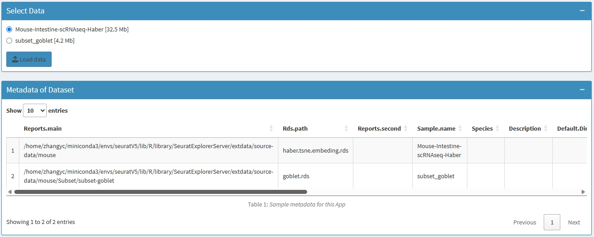

- [SeuratExplorerServer](#seuratexplorerserver)
  - [Table of Contents](#table-of-contents)
  - [Overview](#overview)
    - [SeuratExplorer vs
      SeuratExplorerServer](#seuratexplorer-vs-seuratexplorerserver)
  - [Key Features](#key-features)
    - [🔐 Encrypted Access
      (Optional)](#closed_lock_with_key-encrypted-access-optional)
    - [🔄 Multi-Data
      Switching](#arrows_counterclockwise-multi-data-switching)
    - [📊 Browsing Analysis
      Reports](#bar_chart-browsing-analysis-reports)
    - [⚙️ Customize Initialization
      Parameters](#gear-customize-initialization-parameters)
    - [🚀 Powered by SeuratExplorer](#rocket-powered-by-seuratexplorer)
  - [Live Demo](#live-demo)
  - [Installation](#installation)
    - [Prerequisites](#prerequisites)
    - [Install SeuratExplorerServer](#install-seuratexplorerserver)
    - [Test Installation](#test-installation)
  - [Quick Start](#quick-start)
    - [Step 1: Prepare Your Data](#step-1-prepare-your-data)
    - [Step 2: Create Metadata File](#step-2-create-metadata-file)
    - [Step 3: Create Application](#step-3-create-application)
    - [Step 4: Access Your App](#step-4-access-your-app)
  - [Architecture](#architecture)
    - [Directory Structure](#directory-structure)
    - [Key Components](#key-components)
  - [Database Deployment Guide](#database-deployment-guide)
    - [Phase 1: Configure Shiny Server](#phase-1-configure-shiny-server)
    - [Phase 2: Create Credentials](#phase-2-create-credentials)
    - [Phase 3: Build Data Apps](#phase-3-build-data-apps)
    - [Phase 4: Create Index Page](#phase-4-create-index-page)
  - [Configuration](#configuration)
    - [Launch Parameters](#launch-parameters)
    - [Default Credentials](#default-credentials)
    - [Custom Report File Types](#custom-report-file-types)
  - [Screenshots](#screenshots)
    - [Index Page - Dataset Browser](#index-page---dataset-browser)
    - [Login Interface](#login-interface)
    - [Data Selection](#data-selection)
    - [Report Browser](#report-browser)
    - [Settings Configuration](#settings-configuration)
  - [System Requirements](#system-requirements)
    - [Hardware](#hardware)
    - [Software](#software)
    - [Operating System](#operating-system)
    - [Network](#network)
  - [Troubleshooting](#troubleshooting)
    - [Common Issues](#common-issues)
    - [Debug Mode](#debug-mode)
  - [FAQ](#faq)
    - [Q: Can I use SeuratExplorerServer without Shiny
      Server?](#q-can-i-use-seuratexplorerserver-without-shiny-server)
    - [Q: How do I add a new dataset to an existing
      app?](#q-how-do-i-add-a-new-dataset-to-an-existing-app)
    - [Q: Can different users have different
      credentials?](#q-can-different-users-have-different-credentials)
    - [Q: What’s the maximum file size for Seurat
      objects?](#q-whats-the-maximum-file-size-for-seurat-objects)
    - [Q: How do I backup the
      database?](#q-how-do-i-backup-the-database)
    - [Q: Can I customize the UI
      appearance?](#q-can-i-customize-the-ui-appearance)
  - [Contributing](#contributing)
    - [Reporting Issues](#reporting-issues)
    - [Contributing Code](#contributing-code)
    - [Documentation](#documentation)
  - [Citation](#citation)
  - [License](#license)
  - [Acknowledgments](#acknowledgments)
  - [Session Info](#session-info)
  - [中文介绍](#中文介绍)
    - [主要特点](#主要特点)
    - [相关链接](#相关链接)

<!-- README.md is generated from README.Rmd. Please edit that file -->

# SeuratExplorerServer

<!-- badges: start -->

[](https://lifecycle.r-lib.org/articles/stages.html#stable)
[](https://github.com/fentouxungui/SeuratExplorerServer)
[](https://github.com/fentouxungui/SeuratExplorerServer)
[](https://github.com/fentouxungui/SeuratExplorerServer/stargazers)
[](https://cran.r-project.org/web/licenses/GPL_3)
[](https://deepwiki.com/fentouxungui/SeuratExplorerServer)
<!-- badges: end -->

> **Build your own scRNA-seq database with ease**

SeuratExplorerServer enables bioinformatics engineers to deploy multiple
interactive web applications for visualizing single-cell RNA-seq data.
Each app supports encrypted access, multi-data switching, report
browsing, and customized initialization - all powered by the
comprehensive analysis capabilities of
[SeuratExplorer](https://github.com/fentouxungui/SeuratExplorer).

## Table of Contents

- [Overview](#overview)
- [Key Features](#key-features)
- [Live Demo](#live-demo)
- [Installation](#installation)
- [Quick Start](#quick-start)
- [Architecture](#architecture)
- [Database Deployment Guide](#database-deployment-guide)
- [Configuration](#configuration)
- [Screenshots](#screenshots)
- [System Requirements](#system-requirements)
- [Troubleshooting](#troubleshooting)
- [FAQ](#faq)
- [Contributing](#contributing)
- [Citation](#citation)
- [License](#license)
- [Acknowledgments](#acknowledgments)

## Overview

SeuratExplorerServer is designed for bioinformatics core facilities and
research groups who need to:

- **Share analysis results** with wet-lab researchers through an
  intuitive web interface
- **Manage multiple datasets** in a centralized database with unified
  access
- **Provide secure access** to unpublished data through
  password-protected applications
- **Maintain analysis reports** alongside interactive visualizations
- **Scale deployment** across multiple projects with a single
  infrastructure

### SeuratExplorer vs SeuratExplorerServer

| Feature | SeuratExplorer | SeuratExplorerServer |
|----|----|----|
| **Use Case** | Local analysis on a single dataset | Server-side database for multiple datasets |
| **Data Access** | Upload files to app | Pre-configured data on server |
| **Multi-Data Support** | One dataset per session | Multiple datasets per app |
| **Deployment** | Local machine or single Shiny Server | Multiple apps managed by index page |
| **Authentication** | Not included | Optional password protection |
| **Report Management** | Not included | Built-in report browsing system |
| **Target Users** | Individual researchers | Bioinformatics core facilities |

## Key Features

### 🔐 Encrypted Access (Optional)

Protect unpublished data with password-protected authentication using
[shinymanager](https://github.com/datastorm-open/shinymanager).

``` r
# Simple credential setup
credentials <- data.frame(
  user = "shiny",
  password = "12345",
  stringsAsFactors = FALSE
)
```

### 🔄 Multi-Data Switching

Incorporate multiple Seurat objects from the same analysis pipeline into
a single app. For example, after extracting specific cell types for
further analysis, both the main dataset and subsets can be accessed
through one interface.

### 📊 Browsing Analysis Reports

Automatically organize and display analysis reports generated during the
pipeline. Supported formats include:

**Documents**: `pdf`, `html`, `md`, `Rmd`, `txt`, `csv`, `xlsx`, `xls`,
`xml`

**Images**: `tiff`, `tif`, `jpeg`, `jpg`, `png`, `bmp`, `svg`, `gif`

**Scripts**: `R`, `py`, `sh`, `ipynb`

**Videos**: `mp4`, `avi`

### ⚙️ Customize Initialization Parameters

Set default parameters for each dataset:

- **Cluster Resolution**: Default clustering resolution
- **Species**: Human, Mouse, Fly, or custom
- **Dimension Reduction**: Default visualization method (UMAP, t-SNE,
  etc.)
- **Split Options**: Maximum levels for metadata splitting
- **Assay Selection**: Default assay to display

### 🚀 Powered by SeuratExplorer

All interactive visualization features from SeuratExplorer are included:

- 10+ plot types (Dimensional reduction, Feature plot, Violin, Dot plot,
  Heatmap, etc.)
- DEGs analysis and marker discovery
- Feature correlation and summary statistics
- Multi-assay support (scRNA-seq, scATAC-seq, spatial, CITE-seq)
- Publication-ready PDF downloads

## Live Demo

Experience the full functionality of SeuratExplorerServer:

**[Demo
Database](http://www.nibs.ac.cn:666/SeuratExplorerServer-Index/)**

- **Demo 1**: Fly Gut EEs scRNA-seq (Guo, 2019, Cell Reports)
- **Demo 2**: Mouse Intestine scRNA-seq (Hung, 2020, PNAS)

## Installation

### Prerequisites

1.  **R Environment**: R (\>= 3.5.0)
2.  **Shiny Server**: [Install Shiny
    Server](https://posit.co/download/shiny-server/)
3.  **Dependencies**: Seurat, SeuratExplorer, and other dependencies

### Install SeuratExplorerServer

``` r
# Install devtools if not already installed
if (!require("devtools")) {
  install.packages("devtools")
}

# Install SeuratExplorer (dependency)
devtools::install_github("fentouxungui/SeuratExplorer")

# Install SeuratExplorerServer
options(timeout = max(300, getOption("timeout")))
devtools::install_github("fentouxungui/SeuratExplorerServer")
```

### Test Installation

``` r
library(SeuratExplorerServer)
launchSeuratExplorerServer()
```

This should launch a local instance with demo data.

## Quick Start

### Step 1: Prepare Your Data

Organize your Seurat analysis results with the following structure:

    project_directory/
    ├── analysis_results/
    │   ├── dataset1.rds              # Seurat object
    │   ├── clustering_report.pdf     # Analysis report
    │   ├── markers.csv               # Marker genes
    │   └── figures/                  # Additional plots
    │       ├── umap_plot.png
    │       └── heatmap.pdf
    └── secondary_analysis/           # Optional: cellranger outputs
        └── raw_counts/

### Step 2: Create Metadata File

``` r
library(SeuratExplorerServer)

# Define sample metadata
data_meta <- SeuratExplorerServer::initialize_metadata(
  Reports.main = c("/path/to/analysis1", "/path/to/analysis2"),
  Rds.path = c("dataset1.rds", "dataset2.rds"),
  Reports.second = c(NA, "/path/to/cellranger"),
  Sample.name = c("Dataset 1", "Dataset 2")
)

# Optional: Add custom parameters
data_meta$Species <- c("Mouse", "Human")
data_meta$Default.ClusterResolution <- c("res.0.4", "res.0.8")
data_meta$Default.DimensionReduction <- c("umap", "tsne")
data_meta$Description <- c("First dataset", "Second dataset")

# Verify metadata
check_metadata(parameters = data_meta)

# Save metadata
saveRDS(data_meta, file = "data_meta.rds")
```

### Step 3: Create Application

Create `app.R` in your Shiny Server directory:

``` r
#!/usr/bin/env Rscript
library(SeuratExplorerServer)

# Optional: Set up credentials
credentials <- data.frame(
  user = "your_username",
  password = "your_password",
  stringsAsFactors = FALSE
)

# Launch the app
launchSeuratExplorerServer(
  Encrypted = TRUE,
  credentials = credentials,
  paramterfile = "data_meta.rds",
  TechnicianEmail = "your-email@example.com",
  TechnicianName = "Your Name",
  verbose = FALSE
)
```

### Step 4: Access Your App

Visit your app at: `http://your-server:port/app-directory/`

## Architecture

### Directory Structure

    ShinyServer/                          # site_dir defined in shiny-server.conf
    ├── SeuratExplorerServer-Data/        # Directory for all data apps
    │   ├── project_1/
    │   │   ├── app.R                     # App launch script
    │   │   └── data_meta.rds             # Metadata file
    │   └── project_2/
    │       ├── app.R
    │       └── data_meta.rds
    └── SeuratExplorerServer-Index/       # Index page for all apps
        └── app.R                         # Index app with links to all projects

### Key Components

**Data Apps (`SeuratExplorerServer-Data/`)**

- Individual Shiny apps for each project or analysis
- Contains `app.R` and `data_meta.rds` files
- Supports multiple datasets per app

**Index App (`SeuratExplorerServer-Index/`)**

- Central navigation page for all data apps
- Table view with search and filtering
- Links to external resources and publications

## Database Deployment Guide

### Phase 1: Configure Shiny Server

1.  **Install Shiny Server**

``` bash
# Ubuntu/Debian
sudo apt-get install r-base
sudo su - -c "R -e \"install.packages('shiny')\""
wget https://posit.co/download/shiny-server/amd64/ubuntu/22.04/present/latest.sh
sudo bash latest.sh
```

2.  **Configure Site Directory**

Edit `/etc/shiny-server/shiny-server.conf`:

``` nginx
# Define the site directory
site_dir /home/your-user/ShinyServer;

# Define the log directory
log_dir /var/log/shiny-server;

# Port
port 3838;
```

### Phase 2: Create Credentials

``` r
# Create credentials file
credentials <- data.frame(
  user = c("researcher1", "researcher2", "admin"),
  password = c("password1", "password2", "admin_pass"),
  stringsAsFactors = FALSE
)

# For better security, use hashed passwords
library(shinymanager)
credentials <- data.frame(
  user = c("researcher1", "researcher2"),
  password = sapply(c("password1", "password2"), password_hash),
  stringsAsFactors = FALSE
)

saveRDS(credentials, file = "credentials.rds")
```

### Phase 3: Build Data Apps

For each analysis project, create a data app with metadata:

``` r
library(SeuratExplorerServer)

# Example: Multiple datasets from a time-course experiment
data_meta <- data.frame(
  Reports.main = c(
    "/data/timecourse/day0",
    "/data/timecourse/day3",
    "/data/timecourse/day7"
  ),
  Rds.path = c("day0_seurat.rds", "day3_seurat.rds", "day7_seurat.rds"),
  Reports.second = c(
    "/data/cellranger/day0",
    "/data/cellranger/day3",
    "/data/cellranger/day7"
  ),
  Sample.name = c("Day 0", "Day 3", "Day 7"),
  Species = c("Mouse", "Mouse", "Mouse"),
  Default.DimensionReduction = c("umap", "umap", "umap"),
  Default.ClusterResolution = c("res.0.5", "res.0.5", "res.0.5"),
  SplitOptions.MaxLevel = c(5, 5, 5),
  Description = c(
    "Baseline timepoint",
    "Early response",
    "Late response"
  ),
  stringsAsFactors = FALSE
)

# Verify and save
check_metadata(parameters = data_meta)
saveRDS(data_meta, file = "data_meta.rds")
```

### Phase 4: Create Index Page

**Create Metadata CSV**

``` r
# Create index metadata
entry_info <- data.frame(
  DataType = c("scRNAseq", "scRNAseq", "scRNAseq"),
  Species = c("Mouse", "Human", "Fly"),
  Organ = c("Intestine", "Brain", "Gut"),
  CellType = c("Epithelial", "Neurons", "EEs"),
  scRNAseq.Method = c("10X Genomics", "Smart-seq2", "10X Genomics"),
  Data.Link = c(
    "http://your-server:3838/project_1/",
    "http://your-server:3838/project_2/",
    "http://your-server:3838/project_3/"
  ),
  Official.Link = c(
    "https://example.com/project1",
    "https://example.com/project2",
    NA
  ),
  note = c(
    "10,000 cells from 3 replicates",
    "500 cells from patient samples",
    "4,661 cells from female flies"
  ),
  Source = c("Smith et al., 2023", "Johnson et al., 2024", "Guo et al., 2019"),
  Paper = c(
    "Title of Paper 1",
    "Title of Paper 2",
    "Cellular Diversity of Drosophila Gut"
  ),
  Paper.Link = c(
    "https://doi.org/10.xxxx/paper1",
    "https://doi.org/10.xxxx/paper2",
    "https://doi.org/10.1016/j.celrep.2019.11.048"
  ),
  stringsAsFactors = FALSE
)

write.csv(entry_info, file = "Entry.csv", row.names = FALSE)
```

**Create Index App**

``` r
#!/usr/bin/env Rscript
library(shiny)
library(shinydashboard)
library(DT)

# Helper function to create links
create_links <- function(urls, label = "View") {
  sapply(urls, function(url) {
    if (url %in% c("", "-", NA)) {
      return("-")
    }
    links <- unlist(strsplit(url, ";"))
    link_tags <- paste0(
      '<a href="', links, '" target="_blank">', label, '</a>'
    )
    paste(link_tags, collapse = "<br>")
  }, USE.NAMES = FALSE)
}

# UI
ui <- dashboardPage(
  title = "scRNA-seq Database",
  dashboardHeader(
    title = strong("scRNA-seq Data Hub"),
    titleWidth = 280
  ),
  dashboardSidebar(
    width = 280,
    sidebarMenu(
      menuItem(strong("Browse Data"), tabName = "data", icon = icon("database"))
    )
  ),
  dashboardBody(
    tags$style(HTML("@import url('https://cdnjs.cloudflare.com/ajax/libs/font-awesome/6.0.0/css/all.min.css');")),
    tabItems(
      tabItem(
        tabName = "data",
        fluidRow(
          box(
            title = "Available Datasets",
            width = 12,
            status = "primary",
            solidHeader = TRUE,
            DT::dataTableOutput("dataTable")
          )
        )
      )
    )
  )
)

# Server
server <- function(input, output, session) {
  # Load index data
  indexData <- read.csv("Entry.csv", stringsAsFactors = FALSE)

  # Create links
  indexData$Data.Link <- create_links(indexData$Data.Link, "View Data")
  indexData$Official.Link <- create_links(indexData$Official.Link, "External")
  indexData$Paper.Link <- create_links(indexData$Paper.Link, "Paper")

  # Render table
  output$dataTable <- DT::renderDataTable({
    DT::datatable(
      indexData,
      escape = FALSE,
      options = list(
        pageLength = 15,
        scrollX = TRUE,
        order = list(list(1, 'asc'))
      )
    )
  })
}

shinyApp(ui, server)
```

## Configuration

### Launch Parameters

`launchSeuratExplorerServer()` accepts the following parameters:

| Parameter | Type | Default | Description |
|----|----|----|----|
| `Encrypted` | logical | `TRUE` | Enable password protection |
| `credentials` | data.frame | See below | User credentials for authentication |
| `paramterfile` | character | Auto | Path to metadata RDS file |
| `TechnicianEmail` | character | Required | Contact email for support |
| `TechnicianName` | character | Required | Contact name for support |
| `ReductionKeyWords` | character | `c("umap", "tsne")` | Keywords for dimension reduction |
| `ReportsFileTypes` | character | 27 types | File types to include in reports |
| `DefaultSplitMaxLevel` | integer | `6` | Max levels for split options |
| `SupportedFileTypes` | character | `c("rds", "qs2")` | Seurat file formats to support |
| `verbose` | logical | `FALSE` | Print debug messages |

### Default Credentials

If `Encrypted = TRUE` but no credentials are provided:

``` r
data.frame(
  user = "shiny",
  password = "12345",
  stringsAsFactors = FALSE
)
```

**⚠️ Warning**: Always change default credentials in production!

### Custom Report File Types

Specify which file types to include in the report browser:

``` r
launchSeuratExplorerServer(
  ReportsFileTypes = c(
    # Documents
    "pdf", "html", "md",
    # Images
    "png", "svg", "tiff",
    # Data
    "csv", "xlsx"
  )
)
```

## Screenshots

### Index Page - Dataset Browser

<div class="figure">


<p class="caption">

Database index page with all available datasets
</p>

</div>

### Login Interface

<div class="figure">


<p class="caption">

Secure login for encrypted apps
</p>

</div>

### Data Selection

<div class="figure">


<p class="caption">

Select and switch between multiple datasets
</p>

</div>

### Report Browser

<div class="figure">


<p class="caption">

Browse and download analysis reports
</p>

</div>

<div class="figure">


<p class="caption">

Report file tree structure
</p>

</div>

### Settings Configuration

<div class="figure">


<p class="caption">

Customize default parameters for each dataset
</p>

</div>

## System Requirements

### Hardware

**Minimum**

- CPU: 4 cores
- RAM: 16 GB
- Storage: 100 GB

**Recommended**

- CPU: 8+ cores
- RAM: 32+ GB
- Storage: 500+ GB SSD

### Software

| Component      | Version   | Notes           |
|----------------|-----------|-----------------|
| R              | \>= 3.5.0 | Required        |
| Shiny Server   | Latest    | For deployment  |
| Seurat         | \>= 4.0.0 | Core dependency |
| SeuratExplorer | \>= 0.1.0 | Core dependency |

### Operating System

- **Linux** (Ubuntu 20.04+, CentOS 7+, RHEL 7+): Fully supported
- **macOS**: Development only
- **Windows**: Development only

### Network

- **Port**: Default 3838 (configurable)
- **Bandwidth**: 100+ Mbps recommended for multiple users

## Troubleshooting

### Common Issues

#### 1. App Won’t Start

**Symptoms**: Browser shows “Application not found” or error page

**Solutions**:

``` bash
# Check Shiny Server status
sudo systemctl status shiny-server

# Restart Shiny Server
sudo systemctl restart shiny-server

# Check logs
sudo tail -f /var/log/shiny-server/*
```

#### 2. Data Not Loading

**Symptoms**: Data selection dropdown empty or loading fails

**Solutions**:

``` r
# Verify metadata file
data_meta <- readRDS("data_meta.rds")
check_metadata(parameters = data_meta)

# Check file paths
file.exists(data_meta$Reports.main)
file.exists(data_meta$Rds.full.path)
```

#### 3. Reports Not Showing

**Symptoms**: Report browser shows “No reports available”

**Solutions**:

``` r
# Check if report files exist
list.files(data_meta$Reports.main, pattern = "\\.pdf$")

# Verify file types are supported
launchSeuratExplorerServer(
  ReportsFileTypes = c("pdf", "png", "csv")  # Add your types
)
```

#### 4. Permission Errors

**Symptoms**: “Access denied” or “Permission denied” errors

**Solutions**:

``` bash
# Fix file permissions
sudo chown -R shiny:shiny /path/to/ShinyServer
sudo chmod -R 755 /path/to/ShinyServer

# Check data directory permissions
ls -la /path/to/analysis/
```

#### 5. Out of Memory Errors

**Symptoms**: App crashes when loading large datasets

**Solutions**:

- Increase R memory limit in `Rprofile`:

  ``` r
  # In /etc/R/Rprofile.site
  options(memory.limit = 32000)
  ```

- Use `.qs2` format instead of `.rds` for better compression

- Subset large datasets before loading

### Debug Mode

Enable verbose logging for troubleshooting:

``` r
launchSeuratExplorerServer(
  verbose = TRUE  # Prints detailed debug messages
)
```

Check R console output for detailed error information.

## FAQ

### Q: Can I use SeuratExplorerServer without Shiny Server?

A: Yes, you can run it locally with `launchSeuratExplorerServer()`.
However, Shiny Server is recommended for production deployments as it
provides better performance, stability, and multi-user support.

### Q: How do I add a new dataset to an existing app?

A: Simply update the `data_meta.rds` file with the new dataset
information:

``` r
# Load existing metadata
data_meta <- readRDS("data_meta.rds")

# Add new row
new_row <- data.frame(
  Reports.main = "/path/to/new/dataset",
  Rds.path = "new_data.rds",
  Reports.second = NA,
  Sample.name = "New Dataset"
)

# Update and save
data_meta <- rbind(data_meta, new_row)
saveRDS(data_meta, "data_meta.rds")
```

### Q: Can different users have different credentials?

A: Yes, specify multiple users in the credentials data frame:

``` r
credentials <- data.frame(
  user = c("user1", "user2", "user3"),
  password = c("pass1", "pass2", "pass3"),
  stringsAsFactors = FALSE
)
```

### Q: What’s the maximum file size for Seurat objects?

A: There’s no hard limit, but practical considerations apply:

- **\< 5 GB**: Fast loading, good performance
- **5-20 GB**: Moderate loading time, acceptable performance
- **\> 20 GB**: Long loading times, consider subsetting

### Q: How do I backup the database?

A: Backup two components:

1.  **Metadata files** (`data_meta.rds`, `Entry.csv`, `credentials.rds`)
2.  **Seurat objects** (original `.rds`/`.qs2` files)

``` bash
# Example backup script
tar -czf seurat_db_backup_$(date +%Y%m%d).tar.gz \
  /path/to/ShinyServer/ \
  /path/to/analysis_data/
```

### Q: Can I customize the UI appearance?

A: Yes, you can modify the UI by creating a custom `ui.R` function. See
the [Advanced Customization](#advanced-customization) section.

## Contributing

We welcome contributions! Please see our guidelines:

### Reporting Issues

- Use [GitHub
  Issues](https://github.com/fentouxungui/SeuratExplorerServer/issues)
- Include: R version, package version, error messages, and minimal
  reproducible example

### Contributing Code

1.  Fork the repository
2.  Create a feature branch (`git checkout -b feature/AmazingFeature`)
3.  Commit your changes (`git commit -m 'Add AmazingFeature'`)
4.  Push to the branch (`git push origin feature/AmazingFeature`)
5.  Open a Pull Request

### Documentation

- Improve function documentation with Roxygen2 comments
- Add examples to help files
- Update vignettes and tutorials

## Citation

If you use SeuratExplorerServer in your research, please cite:

``` bibtex
@software{seuratexplorerserver2025,
  title = {SeuratExplorerServer: Build Your Own scRNA-seq Database},
  author = {Zhang, Yongchao},
  year = {2025},
  url = {https://github.com/fentouxungui/SeuratExplorerServer},
  note = {R package version 0.1.3}
}
```

## License

This package is licensed under **GPL (\>= 3)**. See
[LICENSE.md](LICENSE.md) for details.

## Acknowledgments

SeuratExplorerServer is built upon excellent work by:

- **Seurat team** (Satija Lab) for the foundational single-cell analysis
  framework
- **RStudio/Shiny team** for the web application framework
- **SeuratExplorer** for providing comprehensive visualization tools
- **shinymanager** for authentication functionality
- **Bioconductor community** for genomic data tools
- All users and contributors who provide feedback and suggestions

## Session Info

    #> R version 4.4.3 (2025-02-28 ucrt)
    #> Platform: x86_64-w64-mingw32/x64
    #> Running under: Windows 11 x64 (build 26200)
    #> 
    #> Matrix products: default
    #> 
    #> 
    #> locale:
    #> [1] LC_COLLATE=Chinese (Simplified)_China.utf8 
    #> [2] LC_CTYPE=Chinese (Simplified)_China.utf8   
    #> [3] LC_MONETARY=Chinese (Simplified)_China.utf8
    #> [4] LC_NUMERIC=C                               
    #> [5] LC_TIME=Chinese (Simplified)_China.utf8    
    #> 
    #> time zone: Asia/Shanghai
    #> tzcode source: internal
    #> 
    #> attached base packages:
    #> [1] stats     graphics  grDevices utils     datasets  methods   base     
    #> 
    #> other attached packages:
    #> [1] badger_0.2.5
    #> 
    #> loaded via a namespace (and not attached):
    #>  [1] vctrs_0.6.5         cli_3.6.5           knitr_1.51         
    #>  [4] rlang_1.1.6         xfun_0.55           otel_0.2.0         
    #>  [7] generics_0.1.4      S7_0.2.1            jsonlite_2.0.0     
    #> [10] glue_1.8.0          htmltools_0.5.9     rappdirs_0.3.3     
    #> [13] scales_1.4.0        rmarkdown_2.30      dlstats_0.1.7      
    #> [16] grid_4.4.3          tibble_3.3.0        evaluate_1.0.5     
    #> [19] fastmap_1.2.0       yaml_2.3.12         lifecycle_1.0.4    
    #> [22] BiocManager_1.30.27 rvcheck_0.2.1       compiler_4.4.3     
    #> [25] dplyr_1.1.4         fs_1.6.6            RColorBrewer_1.1-3 
    #> [28] pkgconfig_2.0.3     rstudioapi_0.17.1   farver_2.1.2       
    #> [31] digest_0.6.39       R6_2.6.1            tidyselect_1.2.1   
    #> [34] pillar_1.11.1       magrittr_2.0.4      tools_4.4.3        
    #> [37] gtable_0.3.6        yulab.utils_0.2.3   ggplot2_4.0.1

## 中文介绍

[微信公众号：分析力工厂](https://mp.weixin.qq.com/s/g612UEp3DZF-oOHUY13BDA)

SeuratExplorerServer 是一个用于构建单细胞转录组数据库的 R
包，允许生物信息学工程师部署多个交互式网页应用，实现数据共享、加密访问、报告管理等功能。

### 主要特点

- 🔐 加密访问：保护未发表数据
- 🔄 多数据切换：同一应用管理多个数据集
- 📊 报告浏览：自动整理分析报告
- ⚙️ 自定义配置：设置默认参数
- 🚀 集成 SeuratExplorer：完整的可视化分析功能

### 相关链接

- **GitHub**: <https://github.com/fentouxungui/SeuratExplorerServer>
- **在线演示**: <http://www.nibs.ac.cn:666/SeuratExplorerServer-Index/>
- **问题反馈**: [GitHub
  Issues](https://github.com/fentouxungui/SeuratExplorerServer/issues)

------------------------------------------------------------------------

**Made with ❤️ for the single-cell community**
