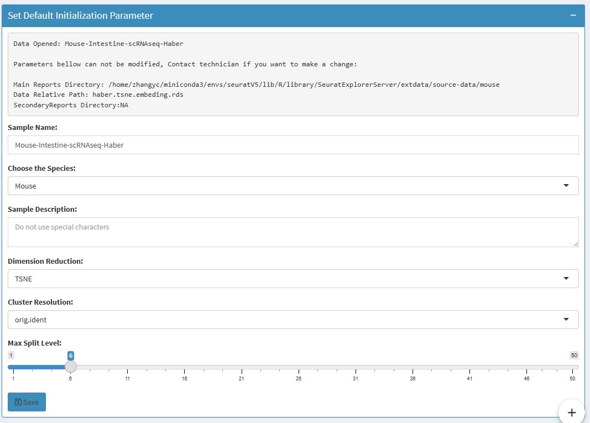

<!-- README.md is generated from README.Rmd. Please edit that file -->

# SeuratExplorerServer

<!-- badges: start -->

[](https://lifecycle.r-lib.org/articles/stages.html#stable)
[](https://github.com/fentouxungui/SeuratExplorerServer)
[](https://github.com/fentouxungui/SeuratExplorerServer)
[](https://deepwiki.com/fentouxungui/SeuratExplorerServer)
<!-- badges: end -->

To build your own scRNA-seq database.

> Allow users to browse the scRNAseq analysis results located at server
> by a web browser, supports encrypted access, multiple data switch,
> review and download analysis reports, customized initialization
> parameters, and further analsysis powered by
> [SeuratExplorer](https://github.com/fentouxungui/SeuratExplorer).

> Bioinformatics engineers can deploy multiple `Apps` via
> `SeuratExplorerServer` for different scRNA-seq project, then to
> construct a scRNA-seq database. Each `App` is accessible through its
> dedicated directory, with all `App` access points and data information
> consolidated into a single `index` webpage, Users can locate and
> access relevant data through the index page.

## Major functions

***Encrypted access*** (optional)

For unpublished data, you can set a password for a restrict access to
the `App`.

***Multi-Data Switching***

After completing an analysis, specific cell type may be extracted for
further analysis, which will yield new `Seurat` objects, multiple
`Seurat` objects can be incorporated into the one App.

***Browsing Analysis Report***

Support browsing, viewing, and downloading analysis report files
generated during the analysis process. You can specify the files types
of files can be included in the reports, such as pdf, html, tiff, csv,
jpg, jpeg, png, bmp, svg etc.

***Customize Initialization Parameters***

Set default parameters for UI, such as Cluster Resolution, Species,
Dimension Reduction etc.

***Powered by `SeuratExplorer`***

`SeuratExplorer` functions like a desktop application, enabling users to
visualize and analyze a single `Seurat` analysis results locally on
their computers at each run, if you want to view another scRNAseq data,
you may have to start another run at the same time. While
`SeuratExplorerServer` enabling users to access multiple scRNA-seq data
located on a server via web interface at each run, and all
functionalities from the `SeuratExplorer` package are included.

## Build Database Step by Step

You can check this [minimal
demo](http://www.nibs.ac.cn:666/SeuratExplorerServer-Index/) (**full
functions**) deployed by `shinyserver`.

Structure of the related files for this app:

``` r
ShinyServer/
├── SeuratExplorerServer-Data
│   ├── demo_1
│   │   ├── app.R
│   │   └── data_meta.rds
│   └── demo_2
│       ├── app.R
│       └── data_meta.rds
└── SeuratExplorerServer-Index
    └── app.R
```

`ShinyServer` is the `site_dir` set in
`/etc/shiny-server/shiny-server.conf`

`SeuratExplorerServer-Data` is the directory contain all the data apps.
two apps are included in this demo

`SeuratExplorerServer-Index` is the app index directory, which contains
all the links to each data app.

### 1. Prerequisties

**1.1 install `shinyserver`**

- install: <https://posit.co/download/shiny-server/>

- docs: <https://docs.posit.co/shiny-server/>

after installation, you need to set the `site_dir` in
`/etc/shiny-server/shiny-server.conf`, for this demo case
`site_dir /home/zhangyc/ShinyServer;` is used.

**1.2 install `SeuratExplorerServer`**

You can install the development version of `SeuratExplorer` and
`SeuratExplorerServer`like so:

``` r
# install dependency
if(!require(devtools)){install.packages("devtools")}
install_github("fentouxungui/SeuratExplorer")

# install SeuratExplorerServer
options(timeout = max(300, getOption("timeout")))
install_github("fentouxungui/SeuratExplorerServer")
```

To test installation:

``` r
library(SeuratExplorerServer)
launchSeuratExplorerServer()
```

**1.3 Source data**

Analysis results by `Seurat`, which can be saved as
`rds, png, tiff, pdf, csv, html`etc.. Bellow is the files structure used
in this demo:

``` r
├── fly
│   ├── CellCycle
│   │   ├── G22M-transition.txt
│   │   ├── TSNE-CellCycle.jpeg
│   │   ├── cellcycle-counts-in-each-cluster.csv
│   │   └──  counts.info.pdf
│   ├── DIMPLOT.pdf
│   ├── Fly-Gut-EEs+res-0.4+Default.csv
│   ├── Rds-file
│   │   └── G101_PC20res04.rds
│   ├── cells.txt
│   └── exclusive-TFs-in-Two-Major-celltypes.html
└── mouse
    ├── Subset
    │   └── subset-goblet
    │       └── goblet.rds
    ├── anno.jpeg
    ├── cluster.markers.res0.6.csv
    └── haber.tsne.embeding.rds
```

This demo has two separated analysis named `fly` and `mouse`, for the
`fly` analysis, only one `rds` file existed, and for the `mouse`
analysis, two `rds` are generated, which means this analysis has two
`data` to be shown. besides, you can also found some other related
reports file, saved as `csv, html, jpeg` in each analysis. Separated
analysis can be under different directory.

Attention, the analysis results should not under the `site_dir`
directory defined in `/etc/shiny-server/shiny-server.conf` file.

### 2. Generate credentials

Set the accounts and passwords for your data hub.

You can refer to R package
[shinymanager](https://github.com/datastorm-open/shinymanager) for
details to generate a credentials file. Bellow codes is used for this
demo.

``` r
# Init DB using credentials data
credentials <- data.frame(
  user = "shiny",
  password = "12345",
  stringsAsFactors = FALSE
)
saveRDS(credentials, file = "credentials.rds")
```

### 3. Build data apps for each analysis

For each analysis, we need to build a app, and each app should be under
the `site_dir` directory defined in
`/etc/shiny-server/shiny-server.conf` file.

**3.1 meta data**

***method 1***: Generate sample meta data from `dataframe`

``` r
# demo
# Use the mouse analysis as demo, and if mouse analysis directory is located in /home/somebody/scRNAseq
# demo data meta file1:inst/extdata/shinyserver_demo/data-page/demo_1/data_meta.rds
# demo data meta file2:inst/extdata/shinyserver_demo/data-page/demo_2/data_meta.rds
data_meta <- data.frame(
  # Required: main analysis directory, Rds file should be contained, and all files under the directory meet the specified file formats 
  # will be included in the reports directory which is named by the Sample.name
  Reports.main = c("/home/somebody/scRNAseq/mouse", "/home/somebody/scRNAseq/mouse/Subset/subset-goblet"), 
  # Required: Rds file path relative to the main analysis directory
  Rds.path = c("haber.tsne.embeding.rds", "goblet.rds"),
  # Optional: secondary analysis directory, all files under the directory meet the specified file formats will as be included in the reports directory 'others', such as results from cellranger command
  Reports.second = c(NA, NA), 
  # Required: Sample name will be shown in the data option
  Sample.name = c("Mouse-Intestine-scRNAseq-Haber", 'subset-goblet'), 
  # Optional: used for set Split options
  SplitOptions.MaxLevel = c(1, 4), 
  # Optional: default dimension reduction
  Default.DimensionReduction = c("tsne", "umap"),
  # Optional: default cluster
  Default.ClusterResolution = c("res.0.4", NA),
  # Optional: Human, Mouse, Fly or Others
  Species = c("Fly", "Mouse"), 
  # Optional: description of the sample or the analysis, or whatever.
  Description = c("blabla","hahaha"), 
  stringsAsFactors = FALSE)

data_meta

# check the meta data
library(SeuratExplorerServer)
invisible(check_metadata(parameters = data_meta))
# if check passed, save the meta data
saveRDS(data_meta, file = "data_meta.rds")
```

The optional parameters can also be set when running `App`.

***method 2***: or use `initialize_metadata` function to generate sample
meta data:

``` r
# demo
library(SeuratExplorerServer)
data_meta <- initialize_metadata(
  Reports.main = c("/home/somebody/scRNAseq/mouse", "/home/somebody/scRNAseq/mouse/Subset/subset-goblet"), 
  Rds.path =c("haber.tsne.embeding.rds", "goblet.rds"),
  Reports.second = c(NA, NA), 
  Sample.name = c("Mouse-Intestine-scRNAseq-Haber", 'subset-goblet'))
data_meta

# saveRDS(data_meta, file = "data_meta.rds")
```

**3.2 data app**

``` r
# app.R
# demo codes1: inst/extdata/shinyserver_demo/data-page/demo_1/app.R
# demo codes2: inst/extdata/shinyserver_demo/data-page/demo_2/app.R
library(SeuratExplorerServer)
credentials <- readRDS("path/to/credentials.rds"))
launchSeuratExplorerServer(Encrypted = TRUE,
                           credentials = credentials,
                           paramterfile = 'data_meta.rds',
                           TechnicianEmail = "your-email",
                           TechnicianName = "your-name",
                           verbose = FALSE)
```

For now, you can use the link (IP\[Port\] + the relative path to
`site_dir` directory) to visit this app.

### 4. Build index app

Next, what we do is to put all app links into a file and build a UI for
users to browse all apps.

**4.1 meta data**

``` r
# analysis metadata
# a demo located in: inst/extdata/shinyserver_demo/index-page/Entry.csv
entry_info <- data.frame(DataType = c("scRNAseq", "scRNAseq"),
                         Species = c("Fly", "Mouse"),
                         Organ = c("Gut", "Gut"),
                         CellType = c("EEs", "Whole"),
                         scRNAseq.Method = c("10X genomics", "10X genomics"),
                         # Required, please change it to your data link
                         Data.Link = c("http://www.nibs.ac.cn:666/SeuratExplorerServer-Data/demo_1/", "http://www.nibs.ac.cn:666/SeuratExplorerServer-Data/demo_2/"),
                         Official.Link = c("https://xilab.shinyapps.io/database/", "https://www.flyrnai.org/tools/rna_seq/web/showProject/23/plot_coord=1/sample_id=all"),
                         note = c("CG32547-GAL4 > GFP; GFP+ EE cells; Female Flies; 4661 cells;", "10,605 midgut epithelial cells from 7-d-old females expressing GFP in progenitors"),
                         Source = c("Guo, 2019, Cell Reports", "Hung, 2020, PNAS"),
                         Paper = c("The Cellular Diversity and Transcription Factor Code of Drosophila Enteroendocrine Cells", "A cell atlas of the adult Drosophila midgut"),
                         Paper.Link = c("https://doi.org/10.1016/j.celrep.2019.11.048", "https://doi.org/10.1073/pnas.1916820117"))
entry_info
write.csv(entry_info, file = "Entry.csv", row.names = FALSE)
```

**4.2 UI**

This app should located under the `site_dir` directory defined in
`/etc/shiny-server/shiny-server.conf` file.

``` r
# app.R
# A minimal example to build a data index page
# located in: inst/extdata/shinyserver_demo/index-page/app.R
library(shiny)
library(shinydashboard)
library(DT)

# trans characters to links
tans_link <- function(Avector,label = "View Data"){
  res <- c()
  for (i in Avector) {
    if (!i %in% c("","-",NA)) {
      res <- append(res,paste(paste0("<a href='",unlist(strsplit(i,split = ";")),"' target='_blank'>",label,"</a>"),collapse = "<br>"))
    }else{
      res <- append(res,"-")
    }
  }
  return(res)
}

ui <- dashboardPage( title = "Demo Data Hub",
                     dashboardHeader( title = strong("Demo Data Hub"), titleWidth = 240),
                     dashboardSidebar(width = 240,
                                      sidebarMenu(menuItem(strong("Data"), tabName = "Data", icon = icon("tachometer-alt")))),
                     dashboardBody(tags$style("@import url(https://use.fontawesome.com/releases/v5.7.2/css/all.css);"),
                                   tabItems(tabItem(tabName = "Data",
                                                    h2(strong("Data")),
                                                    # Attention, you need to change the link bellow, suggest put all data apps under a common directory, here is SeuratExplorerServer-Data.
                                                    h3("Main Entrance: ", tags$a(href = "http://www.nibs.ac.cn:666/SeuratExplorerServer-Data/","Link Here!")),
                                                    br(),
                                                    fluidRow(box(title = "Included Data", width = 12, status = "primary",
                                                                 DT::dataTableOutput("DataIndex")))
                                   ))))

server <- function(input, output, session) {
  # Data
  Data <- read.csv("path/to/Entry.csv", stringsAsFactors = FALSE)
  Data$Data.Link <- tans_link(Data$Data.Link)
  Data$Official.Link <- tans_link(Data$Official.Link)
  Data$Paper.Link <- tans_link(Data$Paper.Link, "View Paper")
  output$DataIndex <- DT::renderDataTable(DT::datatable(Data,escape = FALSE))
}

shinyApp(ui, server)
```

Congratulations, now you can use the link (IP\[Port\] + the relative
path to `site_dir` directory of this app) to browse and search all
analysis, then visit the interested data by click the link of data app.

## Workflow of loading a data app

- Login: input account and password

- Data selection, loading and switch

- Show data meta info

- Browse analysis reports, click `Generate/Update Reports` button, `App`
  will create a directory named by directory name plus `_reports`, such
  as for app located in `Fly-Gut-EEs-scRNAseq` directory, will create a
  directory named with `Fly-Gut-EEs-scRNAseq_reports`, and all files of
  specified format located in directories of `Reports.main` and
  `Reports.second` columns from meta data will be linked to the reports
  directory

- full functions from `SeuratExplorer`

- modify the settings which will takes effect when restart

- the reports directory(`Fly-Gut-EEs-scRNAseq_reports`) will be deleted
  when close the app

## Screenshots




## Rsession info

    #> R version 4.4.3 (2025-02-28 ucrt)
    #> Platform: x86_64-w64-mingw32/x64
    #> Running under: Windows 11 x64 (build 26100)
    #> 
    #> Matrix products: default
    #> 
    #> 
    #> locale:
    #> [1] LC_COLLATE=Chinese (Simplified)_China.utf8 
    #> [2] LC_CTYPE=Chinese (Simplified)_China.utf8   
    #> [3] LC_MONETARY=Chinese (Simplified)_China.utf8
    #> [4] LC_NUMERIC=C                               
    #> [5] LC_TIME=Chinese (Simplified)_China.utf8    
    #> 
    #> time zone: Asia/Shanghai
    #> tzcode source: internal
    #> 
    #> attached base packages:
    #> [1] stats     graphics  grDevices utils     datasets  methods   base     
    #> 
    #> other attached packages:
    #> [1] badger_0.2.4
    #> 
    #> loaded via a namespace (and not attached):
    #>  [1] vctrs_0.6.5         cli_3.6.3           knitr_1.50         
    #>  [4] rlang_1.1.4         xfun_0.52           generics_0.1.4     
    #>  [7] jsonlite_1.8.8      glue_1.7.0          htmltools_0.5.8.1  
    #> [10] scales_1.4.0        rmarkdown_2.29      dlstats_0.1.7      
    #> [13] grid_4.4.3          evaluate_1.0.3      tibble_3.2.1       
    #> [16] fastmap_1.2.0       yaml_2.3.10         lifecycle_1.0.4    
    #> [19] BiocManager_1.30.25 rvcheck_0.2.1       compiler_4.4.3     
    #> [22] dplyr_1.1.4         fs_1.6.4            RColorBrewer_1.1-3 
    #> [25] pkgconfig_2.0.3     rstudioapi_0.17.1   farver_2.1.2       
    #> [28] digest_0.6.36       R6_2.6.1            tidyselect_1.2.1   
    #> [31] pillar_1.10.2       magrittr_2.0.3      tools_4.4.3        
    #> [34] gtable_0.3.6        desc_1.4.3          yulab.utils_0.2.0  
    #> [37] ggplot2_3.5.1

## 中文介绍

[微信公众号：分析力工厂](https://mp.weixin.qq.com/s/g612UEp3DZF-oOHUY13BDA)
